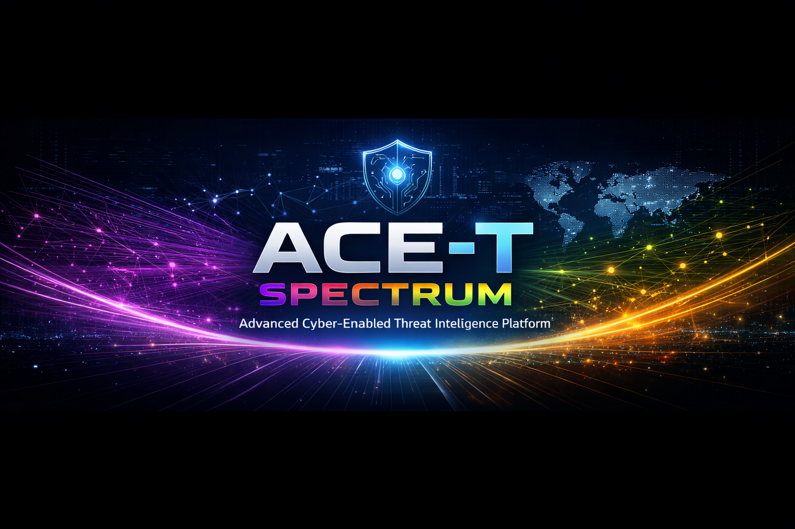
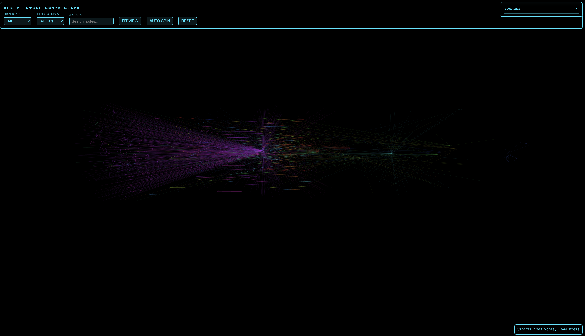

# ACE-T SPECTRUM: Advanced Cyber-Enabled Threat Intelligence Platform

<p align="center">
  
</p>

<p align="left">
  
  
  
  
  
</p>

---

> **Date:** January 17, 2026  
> **Platform:** macOS • Linux • Windows  
> **Languages:** Python 3.11, YAML, JSON, JavaScript  
> **Frameworks:** Dash, Cytoscape, Three.js, SQLAlchemy  
> **License:** MIT  
> **Maintainer:** gs-ai / ACE-T Team

## Overview

ACE-T is a modular Open-Source Intelligence (OSINT) platform for cyber threat intelligence. It provides real-time monitoring of Reddit subreddits and open threat intelligence feeds, with automated data ingestion, normalization, and graph-based visualization. The system processes alerts and indicators of compromise (IOCs), stores them in a SQLite database, and renders interactive 3D graphs for analysis.

Key capabilities include:
- Automated ingestion from Reddit and threat feeds
- Graph assembly with cross-source correlation
- Retention management for data freshness
- 3D Three.js visualization interface
- Configurable YAML-based settings

## Features

- **Real-time OSINT Monitoring**: Continuous ingestion from Reddit subreddits and open threat intelligence feeds (ThreatFox, URLhaus, etc.)
- **Modular Architecture**: Independent adapters for data sources with shared normalization pipeline
- **Graph-Based Visualization**: Interactive 3D Three.js interface with stable positioning and clustering
- **Automated Retention**: Configurable data retention with pruning of old nodes and edges
- **Database Storage**: SQLite-based persistence for alerts and IOCs with SQLAlchemy ORM
- **Cross-Source Correlation**: Automatic linking of indicators across different sources
- **Configurable Feeds**: Enable/disable feeds via YAML configuration
- **Timezone Support**: Fixed timezone rendering for timestamps

## Architecture

### Data Flow

1. **Ingestion**: Reddit posts/comments and threat feed IOCs are fetched periodically
2. **Normalization**: Adapters convert raw data into standardized graph nodes and edges
3. **Graph Assembly**: New data is merged into `data/graph_data.json` with retention enforcement
4. **Storage**: Alerts and IOCs are written to `db/osint.db`
5. **Rendering**: 3D Three.js interface displays the graph

### Key Components

- **Ingestion Scheduler**: Orchestrates periodic runs for Reddit and feeds
- **Adapters**: Convert source-specific data to canonical graph schema
- **Graph Emitter**: Merges and retains graph data
- **Database Writers**: Persist alerts and IOCs
- **GUIs**: Cytoscape for 2D, Three.js for 3D visualization

## Installation

1. Clone the repository and navigate to the project directory:
   ```bash
   cd "ACE-T SPECTRUM"
   ```

2. Create the conda environment:
   ```bash
   conda env create -f src/environment.yml
   conda activate ace-t-env
   ```

3. Install dependencies:
   ```bash
   pip install -r requirements.txt
   ```

4. Initialize the database:
   ```bash
   alembic upgrade head
   ```

5. Configure settings in `config.yml` (see Configuration section)

## Running

Start the system with:
```bash
conda run -n ace-t-env bash run_graph.sh
```

This launches:
- 3D Three.js GUI on `http://127.0.0.1:8050/three_view_3d.html`
- Ingestion scheduler for continuous data updates

## Demo

### 3D Graph Visualization

ACE-T SPECTRUM provides interactive 3D graph visualizations for exploring cyber threat intelligence data. The 3D interface allows for immersive navigation through threat networks, with nodes representing alerts and IOCs, and edges showing relationships.

**Features:**
- Real-time graph updates from live data ingestion
- Color-coded nodes by threat severity and source
- Interactive controls for rotation, zoom, and filtering
- Stable positioning with clustering algorithms

### Screenshots



*The banner above shows the 3D interface with graph visualization.*

## Configuration

### config.yml

Key settings:
- **Retention**: `ACE_T_RETENTION_DAYS` (default 30 days)
- **Feeds**: Enable/disable under `sources.realtime_open_feeds.enabled_feeds`
- **Reddit**: Optional API credentials for authenticated access
- **Scheduler**: Intervals for ingestion runs

Example:
```yaml
sources:
  realtime_open_feeds:
    enabled_feeds:
      - threatfox
      - urlhaus

reddit:
  client_id: "your_client_id"
  client_secret: "your_secret"
  user_agent: "ACE-T:v2.0.0"

ACE_T_RETENTION_DAYS: 30
```

### Timezone

Timestamps are rendered in a fixed timezone defined in `cyto_gui.py`:
```python
TIMEZONE = "US/Central"
```

Supported: `UTC`, `US/Eastern`, `US/Central`, `US/Pacific`, etc.

## Extending the System

### Add a Threat Feed

1. Add feed definition to `THREAT_FEEDS` in `src/modules/realtime_open_feeds.py`
2. Enable in `config.yml` under `sources.realtime_open_feeds.enabled_feeds`
3. The system auto-assigns colors and includes in the legend

### Add a Subreddit

1. Add to `src/runners/subreddit_targets.py`
2. The system auto-generates colors and includes in visualization

### Graph Schema

Nodes and edges follow the canonical schema in `docs/GRAPH_SCHEMA.md`:
- Nodes: id, label, kind, severity, source, timestamp
- Edges: id, source, target, relation, weight
- Deterministic IDs prevent duplicates

## Key Files

- `config.yml`: Runtime configuration
- `src/runners/ingest_scheduler.py`: Scheduler loop
- `src/runners/reddit_live_ingest.py`: Reddit ingestion
- `src/modules/realtime_open_feeds.py`: Feed ingestion
- `src/adapters/emit_graph.py`: Graph retention and merge
- `src/three/export_3d.py`: 3D layout generation
- `gui/three_view_3d.html`: 3D GUI
- `db/alert_writer.py`, `db/ioc_writer.py`: Database persistence

## Reddit Integration

Supports authenticated PRAW API access with automatic fallback to JSON API. Configure credentials in `config.yml` for improved reliability and higher rate limits.

## License

MIT License

## Maintainer

gs-ai / ACE-T Team