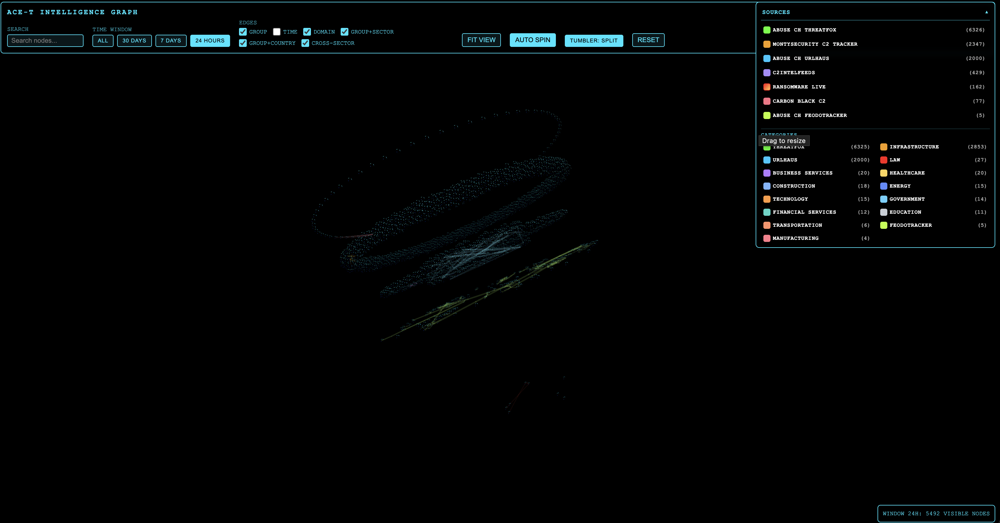
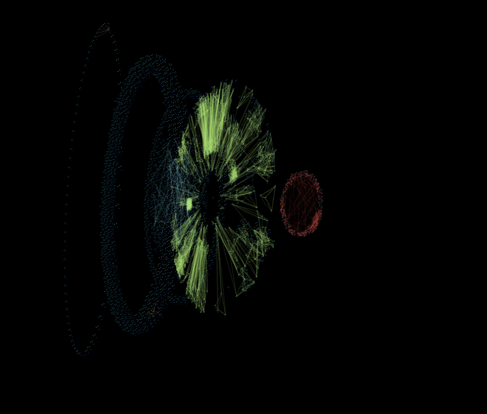

<p align="center">
  
</p>

# SPECTRUM ACE-T: Advanced Cyber-Enabled Threat Intelligence Platform

<p align="left">
  
  
  
  
</p>

---

This is the active codebase. All runnable components live in `SPECTRUMv2`.

## UI Preview

Main graph workspace:



Clustered graph view:



## Quick Start

```bash
cd SPECTRUMv2
python -m venv .venv
source .venv/bin/activate
pip install -r requirements.txt
```

Run the 3D viewer:

```bash
bash run_graph_viewer.sh
```

Run tiered feed ingestion:

```bash
bash scripts/run_tiered_ingest.sh
```

Run the agents framework:

```bash
bash scripts/run_agents.sh
```

## Graph Data Sources

The graph combines multiple feed groups and source families:

### Primary incidents
- `ransomware.live` victim/event feed

### Infrastructure intel
- `abuse.ch threatfox`
- `abuse.ch urlhaus`
- `abuse.ch feodotracker`
- `c2intelfeeds` (verified + 30d)
- `montysecurity c2 tracker`
- `carbon black c2`

### Reputation context (enrichment)
- `blocklist_de`
- `ipsum` levels (3-8)

### Background knowledge (contextual overlays)
- `cisa_kev`
- optional `nvd_cve` (disabled by default)

Source toggles and URLs are configured in `config/ingest_sources.yaml`.
Source color keys for the UI legend are in `graph/data/sources.json`.

## Project Layout

- `graph/`: graph build + viewer server
- `src/`: feed and ingest runners/modules
- `agents/`: agent pipeline runtime
- `db/`: SQLite helpers + schema
- `config/`: ingest source config
- `outside_data/`: local API key/cached feed files
- `data/`: generated ingest outputs + feed cache
- `requirements.txt` / `requirements.lock.txt`: pinned dependencies

## Security and Privacy Notes

- Keep secrets in environment variables or ignored local files only.
- Do not commit API keys, local cache payloads, or private datasets.
- Scripts set `PYTHONPATH` for local package imports from this folder.
- `run_graph_viewer.sh` uses the active interpreter (`PYTHON_BIN` or current `python`).
- Generated graph artifacts are written to `graph/graph_3d.json` and `graph/graph_3d_render.json`.
